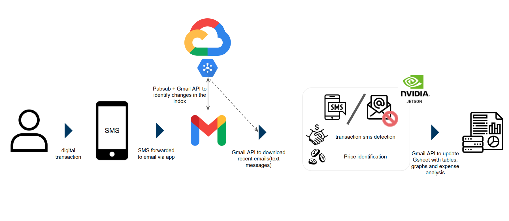

# ExpenseTrackingViaTextMessages
 This repository contains the code base used to communicate with gmail api using G-suite based service account. 
 This communication is used to track changes in the inbox, extract email, 
 deduce relevant financial email(forwarded sms), extract financial data and update to a spreadsheet(for analysis).

